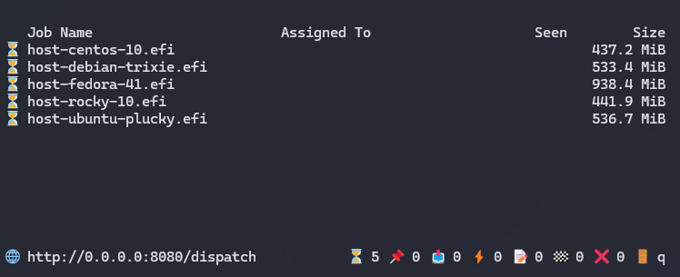
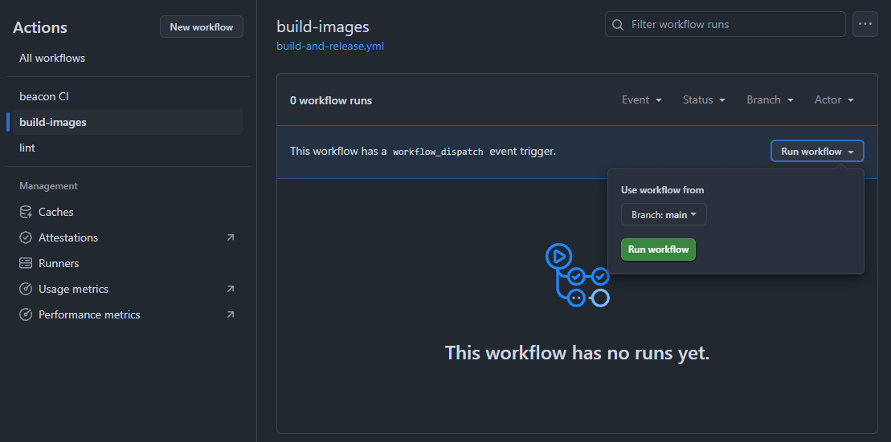

The snpcert repository contains self-service tools to generate AMD SEV certifications for operating systems. The following instructions will utilize the user's AMD EPYC server to run a series of SEV acceptance tests on the operating system and create a Github Issue containing the test results and certificate.

## Requirements
- **[Test Server]** An AMD EPYC server enabled with SEV 3.0 (SNP)
- **[Dispatch Host]** A separate computing instance with the following restrictions:
  - Must have an IP reachable from the AMD EPYC server (the Test Server) for HTTP boot
  - Must have support for:
    - gh (GitHub CLI)
    - avahi-daemon (currently not supported on Windows)

## Dispatch Host Setup

On your Dispatch Host, download and run the [dispatch](https://github.com/AMDEPYC/dispatch) tool. This tool serves images from the `snpcert` repo. These images are configured to boot on the Test Server bare-metal and automatically run a series of tests before transmitting results back to the Dispatch server. Then `dispatch` opens a GH issue in the specified repo with the certification results. See the [dispatch](https://github.com/AMDEPYC/dispatch) README for detailed information about how it works.

### 1. Install dependencies  

Ubuntu, Debian, etc. example:
```
# Install GH and Avahi
sudo apt update
sudo apt install avahi-daemon
sudo apt install gh
```

Red Hat, Fedora, etc. example:
```
# Install GH and Avahi
sudo dnf update
sudo dnf install avahi-daemon
sudo dnf install gh
```

References:
- avahi-daemon https://avahi.org/
- gh https://github.com/cli/cli?tab=readme-ov-file#installation

### 2. Download `AMDEPYC/dispatch`

Download the [latest dispatch binaries](https://github.com/AMDEPYC/dispatch/releases) through your browser or through `gh`:
```
gh release download -R github.com/AMDEPYC/dispatch --pattern 'dispatch-*'
chmod a+x dispatch*
```
Or clone the repository and build it from source.

### 3. Run dispatch to start serving images

#### Permissions

dispatch uses GitHub APIs to download Release Assets and to create Issues in the repo specified on the dispatch command line (see below). Certain permissions are needed for this to work:

##### Option 1

Before running dispatch, run 'gh auth login' and choose to authenticate via the web browser flow.

##### Option 2

Before running dispatch, run 'gh auth login' and choose to authenticate by pasting an authentication token. 

  Fine-grained PAT
  
    If using a fine-grained token (PAT), it must have, at a minimum, the following permissions:
    
      Contents: Read-only access
      
      Issues: Read and write access
  
  Classic PAT
  
    If using a classic token (PAT), it must have, at a minimum, the following permission:
    
      repo

##### Option 3

When running dispatch, use the --token option and specify either a fine-grained or a classic PAT as described above.

##### Option 4

Before running dispatch, set an environment variable named GITHUB_TOKEN to either a fine-grained or a classic PAT as described above.

---

If you would like to use the images available in AMD's sev-certify repository & post the results in an issue there:
```
./dispatch-linux-x86_64 --owner AMDEPYC --repo snpcert --tag devel
```

You can optionally add a filter at the end if you want to run on a subset of images:
```
./dispatch-linux-x86_64 --owner AMDEPYC --repo snpcert --tag devel ubuntu
```

You can also fork the `AMDEPYC/snpcert` repository to build the images and have certification results posted in that repository's issues - see [Forking snpcert](#forking-amdepycsnpcert-for-certification-testing) for more information.
```
./dispatch-linux-x86_64 --owner <your org/username> --repo snpcert --tag devel
```

If you run the first command with no filter specified, you should see the following screen:  


While this screen is up, the images specified are queued for testing. Each image has an status icon to the left of its name. See [Workflow-Stats](https://github.com/AMDEPYC/dispatch?tab=readme-ov-file#workflow-states) for a table of the icon meanings. Pressing q will kill the dispatch process.

## Test Server Setup

### Reference Manuals
- [Using SEV with AMD EPYC processors](https://www.amd.com/content/dam/amd/en/documents/epyc-technical-docs/tuning-guides/58207-using-sev-with-amd-epyc-processors.pdf)
- [HPE Gen11 Reference](https://support.hpe.com/hpesc/public/docDisplay?docId=sd00003788en_us&page=GUID-0F514002-9AE6-41F1-9005-1B910268FFD0.html)
- [Dell EMC PowerEdge Reference](https://www.dell.com/support/manuals/en-ai/poweredge-r7525/r7525_bios_ism_pub/processor-settings?guid=guid-ec36d324-4f45-4bc1-bb51-de2db7cc5cd9)
- [Lenovo ThinkSystem Reference](https://lenovopress.lenovo.com/lp1893-enabling-amd-sev-snp-on-thinksystem-servers)

Some server manuals may not yet be listed.

### 1. Ensure SEV features are enabled on your hardware & firmware
Instructions may differ based on the server offering. This may involve updating your firmware and enabling AMD SEV features in the BIOS/UEFI. See the Reference Manuals section above.

Running a certification test on a Test Server that is not property configured for SEV will result in an early failure on the `snphost ok` check. You can check the Github issue output for details on the specific SEV feature missing.

### 2. Enable HTTP boot
Set the HTTP boot path using the URL & port of your dispatch server. See the Reference Manuals section above for instructions. By default `dispatch` will expose port 8080 on your server, so the URL will look like:
```
http://<server.ip.address>:8080/dispatch
```
> [!NOTE]
> Some server boot menus check that the path contains the .efi or .iso extension. Add a query parameter as a workaround:
> ```
> http://<server.ip.address>:8080/dispatch?foo.efi
> ```
> In the future dispatch will support adding the extension.


> [!NOTE]
> Currently http, not https, must be used.
>
> Hint: In the BIOS/UEFI settings, the URL should be specifiable as part of a Network/HTTP setting and being able to specify should not require disabling DHCP.

Start the machine with this boot option selected. If you have several images queued in dispatch and you'd like them all run automatically, set the boot order with http boot as the first in the list.

### 3. Boot the machine using HTTP boot
If configured correctly, in the Test Server's console you'll see it downloading the host image. You can switch back to your dispatch server and watch for the status of the test via the icons to the left of the images. See [Workflow-Stats](https://github.com/AMDEPYC/dispatch?tab=readme-ov-file#workflow-states) for a table of the icon meanings. When it reaches 🏁 , you should see a new Github Issue in the repository that you specified when invoking `dispatch`.

## Forking `AMDEPYC/snpcert` for certification testing
If you wish to build alternate images and/or send test results to an alternate repository, fork `AMDEPYC/snpcert` into your organization or personal account.

### 1. Fork the repository
Fork this repository into your account or organization: [AMDEPYC/snpcert](https://github.com/AMDEPYC/snpcert)
See [Forking a Repository](https://docs.github.com/en/pull-requests/collaborating-with-pull-requests/working-with-forks/fork-a-repo#forking-a-repository)

### 2. Build Images
Trigger the github actions (either manually or through pushing a commit) to create a release with images.

Manually:  


In either case, after this is complete you should see releases with tags `devel` in your fork.

### 3. Enable Issues
If they are not already enabled, check the box to enable issues, so that `dispatch` can send certification results in the form of a new issue. See [Disabling issues](https://docs.github.com/en/repositories/managing-your-repositorys-settings-and-features/enabling-features-for-your-repository/disabling-issues) for the checkbox location.

### 4. Run dispatch
You can now run dispatch while specifying the new repository:
```
./dispatch-linux-x86_64 --owner <your-org or username> --repo snpcert --tag devel
```

